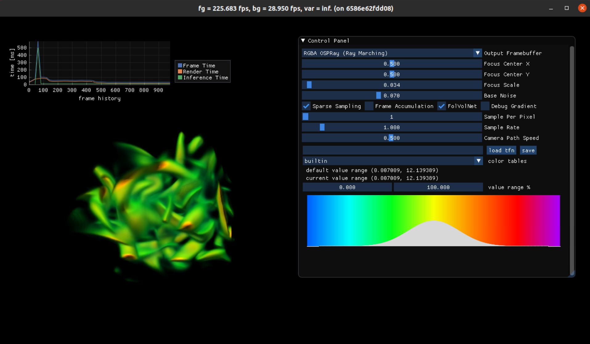

# FoVolNet 

The public release of FoVolNet



## TODO

- [x] build instruction (including ospray + optix)
- [ ] pretrained models
- [ ] datasets
- [ ] running instructions
- [ ] cleanup unnecessary data files

### Build Render App

#### Build with our docker container (recommended)

```bash
docker build -t fovolnet . -f ovrmodule/docker/Dockerfile 

# or specify the CUDA architecture you want
docker build -t fovolnet . -f ovrmodule/docker/Dockerfile --build-arg="CUDA_ARCH=89"

# run the scrpit to launch our sample app
./projects/fovolnet/ovrmodule/run_docker.sh 

# or if running with VirtualGL
vglrun ./projects/fovolnet/ovrmodule/run_docker.sh 
```

#### Build directly

This project is expected to be built with our lightweight scientific visualization development framework, [OVR](https://github.com/VIDILabs/open-volume-renderer). Our project currently require an NVIDIA GPU with compute compatibility >= 7.0.

```bash
# Download the development framework
git clone --recursive https://github.com/VIDILabs/open-volume-renderer.git
cd open-volume-renderer/projects

# Download the source code
git clone --recursive git@github.com:DBauer15/FoVolNet.git
cd ..
```

Then please install TensorRT, LibTorch & TorchTensorRT, OptiX and OSPRay.
For OSPRay, please use our customized binary release [here](https://github.com/wilsonCernWq/ospray/releases/tag/sparse_sampling_v2.11.0).

Then specify the path to the installed libraries via environment variables.
For example:
```bash
export CUDA_ARCHITECTURES="89"
export OptiX_INSTALL_DIR=/media/data/qadwu/Software/NVIDIA-OptiX-SDK-7.3.0-linux64-x86_64
export ospray_DIR=/home/qadwu/Software/ospray-2.11.0.x86_64.linux_sparse_sampling/lib/cmake/ospray-2.11.0
export LibTorch_ROOT=/home/qadwu/Software/libtorch-shared-with-deps-1.12.1-cu116/libtorch
export TensorRT_ROOT=/home/davbauer/software/TensorRT-8.2.3.0
export TorchTensorRT_INSTALL_DIR=/home/davbauer/software/torch_tensorrt
```

Then you can use our script to build the application.
```bash
bash ./projects/fovolnet/ovrmodule/build.sh Release

# run the scrpit to launch our sample app
./projects/fovolnet/ovrmodule/run.sh

# or if running with VirtualGL
vglrun ./projects/fovolnet/ovrmodule/run.sh
```
